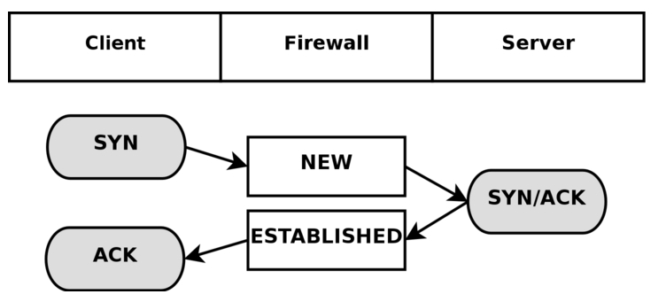

就不去细说iptables是干嘛的了。网络包在内核里会有几种状态，那么iptables也相应的支持对相应状态的包进行管理，下面直接来说说支持的状态是哪些。

NEW
----
NEW状态表示这个包是第一个发过来的。这意味着iptables会匹配被跟踪模块发现的第一个发过来的网络包。

ESTABLISHED
---
ESTABLISHED状态表示连接的双方向都收到了包。也就是说一个主机在发出第一个包之后收到了一个回复包。NEW状态在收到回复包或者通过了防火墙之后编程ESTABLISHED状态。

RELATED
---
RELATED就是一个相对比较微妙的状态了。RELATED状态指当前关联了另一个ESTABLISHED状态的连接。就是说首先要有一个ESTABLISHED状态的连接，这个连接会在主连接之外生成一个连接，这个新的连接就处于RELATED状态。

INVALID
---
INVALID表示这个包无法辨认，无法确认它的状态，可能有多种原因。

UNTRACKED
---
在Raw表里被匹配执行了NOTRACK的包会变成UNTRACKED状态。这表示这些包在经过接下来的链的时候不会被匹配上。

下面一个TCP建立连接的图来简要介绍状态在这个过程中的变化：

