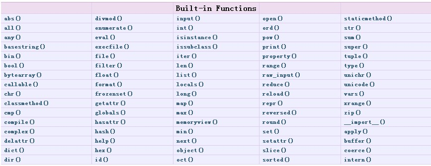

Python类的魔法之三——改变对象的build-in函数的执行
=======

在Python里有一些内建函数，具体见下图：

内建函数提供了一些常用的函数。不过通过魔术方法的使用，这些内建函数的行为也是可以改变的。
以len()为例。len是用来计算对象长度的函数，我们可以来改变使用len时的行为：
```python
class Test(object):
    def __len__(self):
        print 'get the length'
        return 0

a = Test()
len(a)
get the length
0
```
以这个例子为参考，实际上其他的内建方法的修改都差不多了
